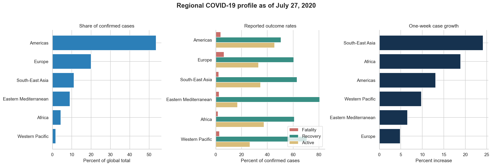

# Global COVID-19 Country Snapshot Analysis

An exploratory analysis of reported COVID-19 cases across 187 countries and six WHO regions as of July 27, 2020. The project turns a country-level snapshot, roughly four months into the pandemic, into reproducible regional comparisons, country rankings, and data-quality checks.



## Questions answered

- How were confirmed cases distributed across WHO regions?
- How did fatality, recovery, active-case, and one-week growth rates differ by region?
- Which countries accounted for the largest reported case and death totals?
- Which countries had the fastest weekly growth after controlling for small denominators?
- Does the source data reconcile and contain missing or duplicate country records?

## Key findings

- The dataset contains 16.48 million confirmed cases across 187 countries. The global case fatality rate was 3.97%, and confirmed cases grew 12.01% from the previous week.
- The Americas accounted for 53.6% of all confirmed cases and 52.4% of deaths in the snapshot.
- Europe had the highest regional case fatality rate at 6.40%, while the Eastern Mediterranean had the highest reported recovery rate at 80.59%.
- South-East Asia had the fastest weighted one-week growth at 24.15%, followed by Africa at 18.93%.
- Among countries with at least 1,000 confirmed cases, Zimbabwe had the largest one-week percentage increase at 57.85%.

These are descriptive comparisons of reported data. They do not measure infection risk, nations' health-system quality, or causal effects because testing, reporting, population size, and case definitions differed across countries.

## Repository structure

```text
covid19-country-analysis/
├── data/
│   └── country_wise_latest.csv
├── notebooks/
│   └── covid19_country_analysis.ipynb
├── reports/
│   └── figures/
│       ├── country_rankings.png
│       ├── regional_overview.png
│       └── reported_cases_vs_deaths.png
├── src/
│   ├── __init__.py
│   └── analysis.py
├── tests/
│   └── test_analysis.py
├── .gitignore
├── LICENSE
├── README.md
└── requirements.txt
```

## Methods

The analysis uses pandas for validation, transformation, and aggregation; seaborn and Matplotlib for visualization; and Python's built-in `unittest` framework for transformation checks. Regional rates are calculated from aggregated numerators and denominators rather than by averaging country percentages, which prevents small countries from receiving disproportionate weights.

The weekly growth ranking applies a minimum of 1,000 confirmed cases to reduce the small-base effect. The cutoff is an analytical choice and is stated in every related output.

## Run the project

```bash
python -m venv .venv
source .venv/bin/activate  # Windows: .venv\Scripts\activate
python -m pip install -r requirements.txt
jupyter notebook notebooks/covid19_country_analysis.ipynb
```

Run the validation tests from the repository root:

```bash
python -m unittest discover -s tests -v
```

## Data source

The included `country_wise_latest.csv` file is a historical snapshot distributed through the [Kaggle Corona Virus Report dataset](https://www.kaggle.com/datasets/imdevskp/corona-virus-report). The analysis uses the supplied snapshot as-is and does not represent current COVID-19 conditions.

## Limitations

- The file is a single snapshot, so it cannot support epidemic forecasting or long-term trend analysis.
- Counts are not adjusted by population, and the dataset does not include testing volume, demographics, vaccination, or policy variables.
- Differences between countries' data may reflect reporting practices and data availability in addition to real epidemiological differences.
- “Recovered” definitions and reporting frequency were not standardized across countries.

## Author

Oluwaseyi Folorunso  
[LinkedIn](https://www.linkedin.com/in/oluwaseyi-folorunso/)

